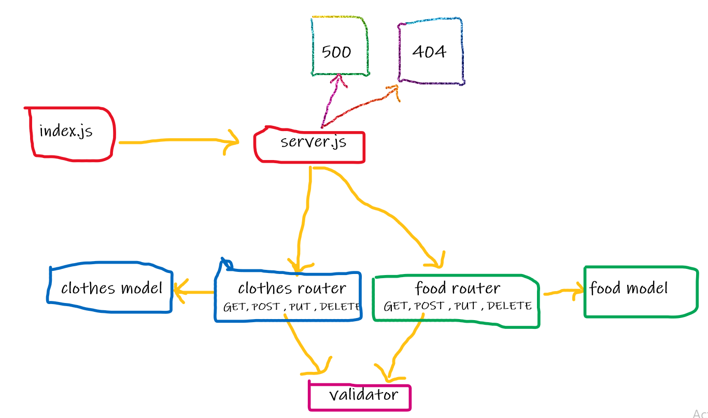

# basic-api-server

## Links:

[Heroku link](https://bz-server-api-deploy-prod.herokuapp.com/)  

[GitHub action link](https://github.com/bahazghayar/basic-api-server/actions)  

[Pull request link](https://github.com/bahazghayar/basic-api-server/pull/2)  

### For working on the same project:

1. clone the repo
2. install the dependencies `npm i express dotenv supertest eslint jest`
3. change the package.json file to
                "scripts": {
                "start": "node index.js",
                "dev": "nodemon" ,
                "test": "jest --coverage --verbose",
                "lint": "eslint '**/*.js'"
                }

# UML

